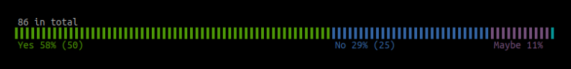
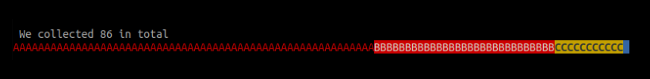
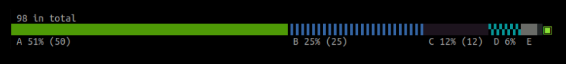

# percbar

Display data in horizontal percentage bar.  
This is static bar. If you looking for dynamic progress bar, check these great packages:  https://github.com/schollz/progressbar and https://github.com/cheggaaa/pb .

## Preview

### Default
```go
data := map[string]int{
	"Yes": 50,
	"No": 25, 
	"Maybe": 10,
	"N/A": 1,
}
bar := percbar.New(data) 
fmt.Println(bar)
```
 

### No colors / `OptionsColorBlind`
```go
data := map[string]int{
	"Yes": 50,
	"No": 25, 
	"Maybe": 10,
	"N/A": 1,
}
bar := percbar.New(data).SetOptions(percbar.OptionsColorBlind)
fmt.Println(bar)
```
```
 86 in total
██████████████████████████████████████████████████████████▐▐▐▐▐▐▐▐▐▐▐▐▐▐▐▐▐▐▐▐▐▐▐▐▐▐▐▐▐░░░░░░░░░░░▚
 Yes 58% (50)                                              No 29% (25)                  Maybe 11%  
```

### More option presets
- `OptionsDefault`
- `OptionsColorBlind`
- `OptionsColorBlind2`
- `OptionsRGB`
- `OptionsBgColors`
- `OptionsDescending`

### Custom

- `Chars` - character sequence used to make bar 
- `Colors` - colors sequence for bar. 
- `Header` - do you need header? Use `{SUM}` placeholder to replace with total count
- `HaveFooter` -  do you need footer?
- `AllowFooterColors` - use same colors for footer too? 

Here is some _frankenstein_:
```go
	fmt.Println(New(data).SetOptions(&Options{
		Chars:      "ABCDEF",
		Colors:     "red, white:red, black:yellow:bold, blue:blue",
		Header:     "We collected {SUM} in total",
		HaveFooter: false,
	}))
```
 


### Mixing options
```go
    bar := percbar.New(values).SetOptions(percbar.OptionsColorBlind)
    bar.options.Colors = percbar.OptionsDefault.Colors // use colors from another preset
    fmt.Println(bar)
```
 


#### Syntax of how to assign colors
Colors based on  https://github.com/fatih/color package. Thanks!
```go
	Colors:     "red, white:red, black:yellow:bold, blue:blue",
```
Comma separated list. Each item can be written as `red:blue:bold` - **Red** text, **Blue** background and all in **Bold**.  
Or **Red** and **Bold** as `red:bold`.

Append at the and for multiple text styles: `red:bold:underline:italic`.

- Available colors: `black`, `red`, `green`, `yellow`, `blue`, `magenta`, `cyan`, `white`, `hiblack`, `hired`, `higreen`, `hiyellow`, `hiblue`, `himagenta`, `hicyan`, `hiwhite`.
- Available text styles: `bold`, `faint`, `italic`, `underline`, `blinkslow`, `blinkrapid`, `reversevideo`, `concealed`, `crossedout`.
